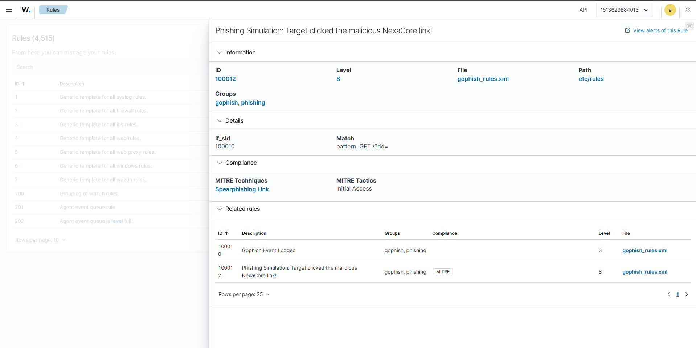
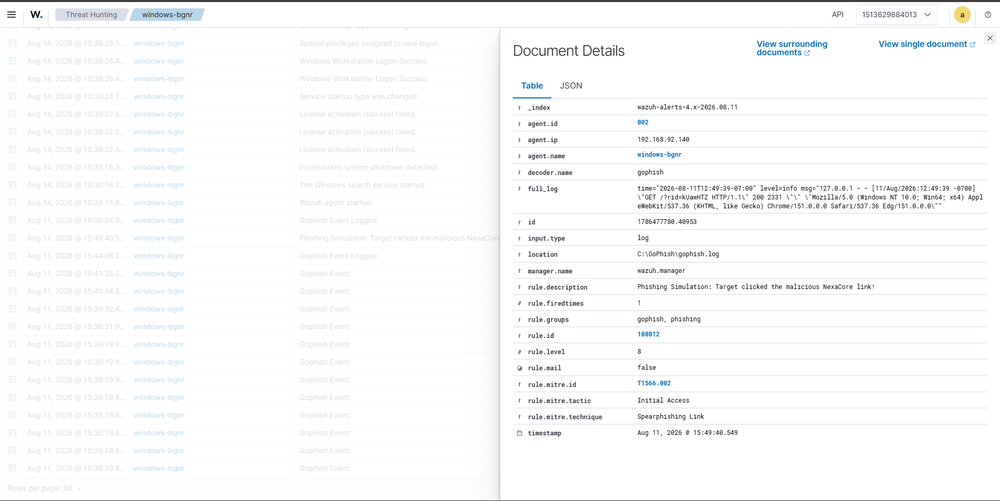
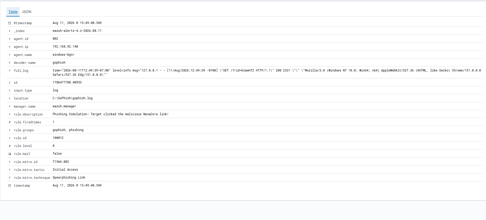
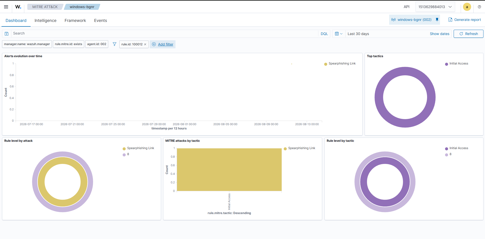
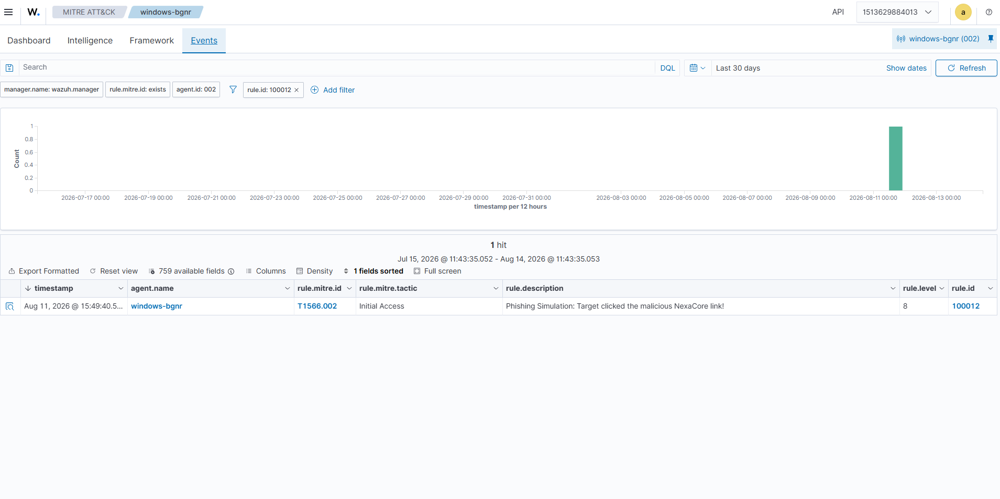

# SIM-001 — NexaCore Recruitment Phishing Detection

## Overview

SIM-001 is an authorized, single-user phishing-awareness simulation used to validate an end-to-end detection pipeline between GoPhish and Wazuh. The scenario used a fictional NexaCore Technologies internship message delivered to a controlled test account through Mailtrap. No real credentials were collected.

The defensive objective was to verify that a simulated link interaction could be recorded by GoPhish, collected from the Windows endpoint, decoded by Wazuh, evaluated by custom rules, mapped to MITRE ATT&CK, and surfaced as an analyst-visible alert.

## Validation Results

| Component | Observed result |
|---|---|
| GoPhish email sent | 1 |
| Email opened | 1 |
| Link clicked | 1 |
| Data submitted | 0 |
| Email reported | 0 |
| Wazuh base rule | `100010` — Level 3 |
| Wazuh phishing rule | `100012` — Level 8 |
| Decoder | `gophish` |
| MITRE ATT&CK | `T1566.002` — Spearphishing Link |
| Observed source log | `C:\GoPhish\gophish.log` |

These campaign values validate the lab workflow only; a single operator-controlled interaction is not a meaningful phishing-susceptibility statistic.

## Detection Architecture

```text
GoPhish recruitment simulation
          |
          v
Controlled Mailtrap recipient
          |
          v
Simulated link interaction
          |
          v
C:\GoPhish\gophish.log
          |
          v
Windows Wazuh agent
          |
          v
Wazuh manager
          |
          v
gophish / gophish-detail decoders
          |
          v
Rule 100010 — Level 3
Gophish Event Logged
          |
          | if_sid=100010
          v
Rule 100012 — Level 8
match: GET /?rid=
          |
          v
MITRE T1566.002
Spearphishing Link
          |
          v
Wazuh alert and analyst investigation
```

## Event Decoding

The custom parent decoder identifies GoPhish-formatted log entries using the `msg=` marker:

```xml
<decoder name="gophish">
  <prematch>msg=</prematch>
</decoder>
```

A child decoder parses the log level and message:

```xml
<decoder name="gophish-detail">
  <parent>gophish</parent>
  <regex>level=(\S+) msg="([^"]+)"</regex>
  <order>gophish_level, gophish_msg</order>
```

The lab copy retrieved from the running manager is documented as observed. The displayed file ended after the `<order>` line; the repository does not silently "repair" or claim a different deployed configuration.

## Rule 100010 — Baseline GoPhish Telemetry

```xml
<rule id="100010" level="3">
  <decoded_as>gophish</decoded_as>
  <description>Gophish Event Logged</description>
</rule>
```

Rule `100010` establishes that an event was decoded as GoPhish telemetry. It is a baseline event, not by itself evidence of a phishing interaction.

## Rule 100012 — Simulated Link Interaction

```xml
<rule id="100012" level="8">
  <if_sid>100010</if_sid>
  <match>GET /?rid=</match>
  <description>Phishing Simulation: Target clicked the malicious NexaCore link!</description>
  <mitre>
    <id>T1566.002</id>
  </mitre>
</rule>
```

Rule `100012` depends on Rule `100010` and then looks for the GoPhish tracked-link request pattern. This provides application context before escalating the event to Level 8.

## Observed Alert

The Wazuh event view confirmed the following fields during SIM-001:

| Field | Value |
|---|---|
| Rule ID | `100012` |
| Rule level | `8` |
| Fired times | `1` |
| Decoder | `gophish` |
| Groups | `gophish`, `phishing` |
| MITRE ID | `T1566.002` |
| MITRE tactic | Initial Access |
| MITRE technique | Spearphishing Link |
| Description | Phishing Simulation: Target clicked the malicious NexaCore link! |
| Observed timestamp | Aug 11, 2026 @ 15:49:40.549 |
| Source log | `C:\GoPhish\gophish.log` |

Environment-specific agent identifiers and addresses should be sanitized from public screenshots where they do not contribute to the analysis.

## Why Rule Chaining Matters

The two rules have deliberately different responsibilities:

```text
Decoded GoPhish event
       |
       v
100010: identify GoPhish telemetry
       |
       v
100012: identify tracked-link request
       |
       v
Level 8 phishing-simulation alert
```

Using `<if_sid>100010</if_sid>` means the higher-severity rule is evaluated in the context of an event already classified as GoPhish telemetry. This is preferable to treating every unrelated log containing `GET /?rid=` as equivalent evidence.

## MITRE ATT&CK Mapping

The simulated interaction is mapped to `T1566.002 — Phishing: Spearphishing Link`, under the Initial Access tactic. The mapping describes the technique represented by the authorized simulation; it does not assert the presence of a real threat actor or successful compromise.

## Analyst Interpretation

The alert establishes that Wazuh observed a GoPhish event matching the lab's tracked-link detection condition. It does **not** independently establish credential compromise, malware execution, persistence, endpoint compromise, or an external attacker.

A SOC analyst reviewing this event would validate the event source, endpoint, timestamp, decoder, parent/child rule relationship, campaign context, and whether the interaction was an authorized simulation before deciding on escalation.

## Detection Limitations

The current rule is intentionally narrow and simulation-specific. Validation should account for repeated requests, browser refreshes, automated scanners, malformed GoPhish events, legitimate lab testing, and other applications that may generate similar strings. The `GET /?rid=` condition is tied to the implemented GoPhish workflow and should not be presented as a generalized enterprise phishing detector.

## Evidence

The SIM-001 Wazuh evidence set contains five sanitized screenshots. Each screenshot demonstrates a different stage of the detection and investigation workflow.

### 01 — Event Detection

Shows the Wazuh Events view containing the SIM-001 phishing alert generated by Rule `100012`.



### 02 — Rule Details

Shows the custom Rule `100012`, including its Level 8 severity, tracked-link match condition, and ATT&CK mapping.



### 03 — Alert Document Details

Shows the underlying alert fields, including the `gophish` decoder, GoPhish log source, rule ID, severity, and MITRE ATT&CK metadata.



### 04 — Wazuh Dashboard

Shows the SIM-001 alert represented in the Wazuh dashboard interface.



### 05 — Events Filtered to Rule 100012

Shows the Events view filtered specifically to `rule.id: 100012`, isolating the SIM-001 detection for investigation.



Rule `100010` and the custom decoder are documented as configuration evidence in this repository; a separate screenshot was not required for the final SIM-001 evidence set. The existing GoPhish campaign report provides the simulation-side evidence.

## Outcome

SIM-001 successfully demonstrated the path from controlled social-engineering simulation to defensive telemetry: campaign interaction, endpoint log collection, custom decoding, baseline classification, chained detection, ATT&CK mapping, alerting, and analyst investigation.
