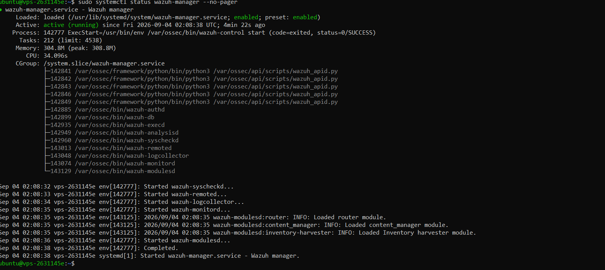
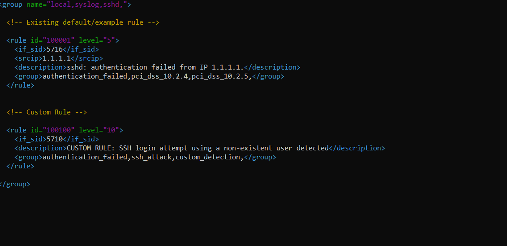
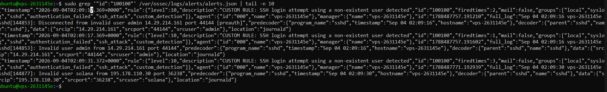
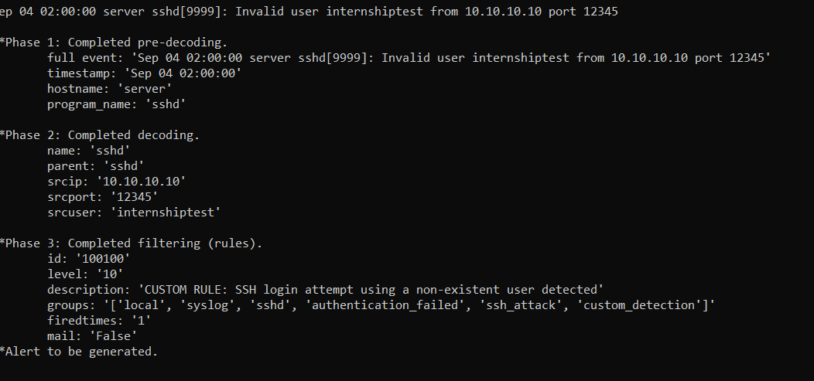

# Custom Wazuh SSH Detection Rule

## Objective

Create and validate a local Wazuh detection rule as part of the endpoint validation and triage workstream.

## Implementation

A new local rule was created with ID **100100**. The rule was added as a new custom rule rather than modifying an existing built-in Wazuh rule.

The validation focused on Wazuh's rule-processing workflow:

```text
Log event
   ↓
Decoder
   ↓
Rule matching
   ↓
Custom Rule ID 100100
   ↓
Alert generation
   ↓
Analyst-visible evidence
```

## Evidence

The following screenshots document the validation:

### 1. Wazuh Manager Active



### 2. Custom Rule 100100



### 3. Alert Evidence



### 4. Wazuh Logtest Validation



## Validation Outcome

The evidence demonstrates that:

- A custom local rule was created with a dedicated rule ID.
- The Wazuh Manager was operational during validation.
- The rule-processing path was tested with Wazuh tooling.
- Alert evidence was captured for the custom detection workflow.

## Why This Matters

This implementation demonstrates basic detection engineering rather than relying exclusively on default SIEM alerts. Creating a dedicated rule ID and validating the rule-processing path provides evidence of:

- Custom Wazuh rule development
- Rule validation and troubleshooting
- Alert generation
- Evidence collection
- Reproducible security monitoring workflow

## Scope

This validation is intentionally documented according to the evidence collected. It does not claim unrelated Windows detection capabilities that have not yet been independently validated.

## Interview Takeaway

A useful way to describe this work is:

> "I deployed Wazuh in a cloud-hosted lab, connected endpoints for centralized monitoring, and extended the default detection capability by creating and validating a custom local Wazuh rule. I captured evidence from the manager, rule configuration, alert output, and Wazuh rule-testing workflow."

